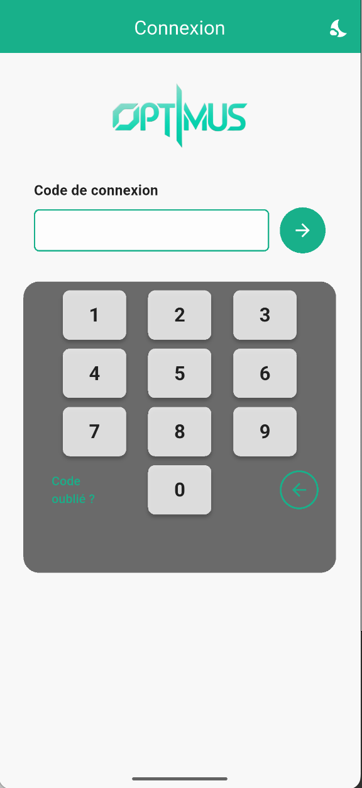
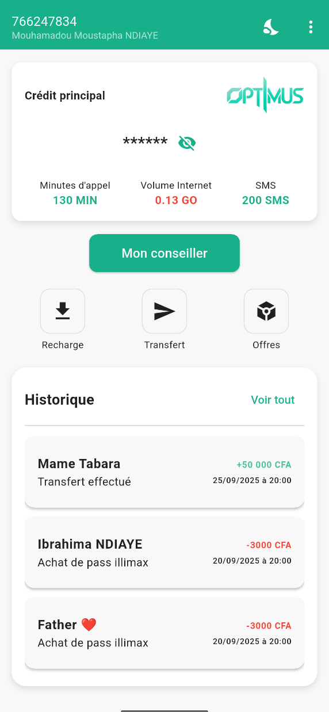
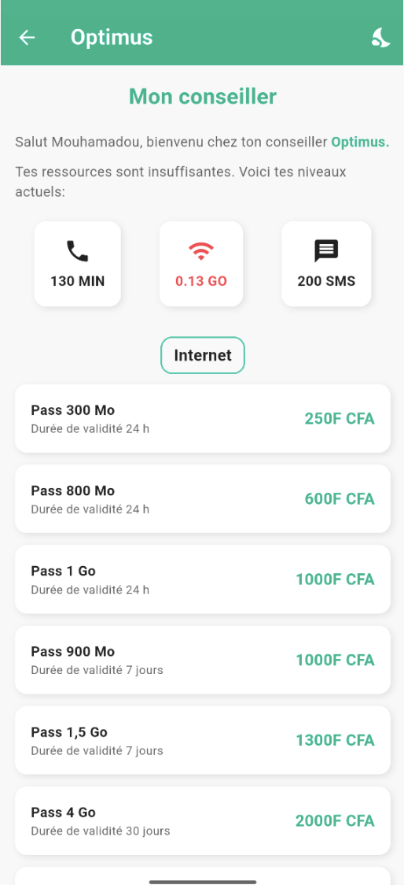
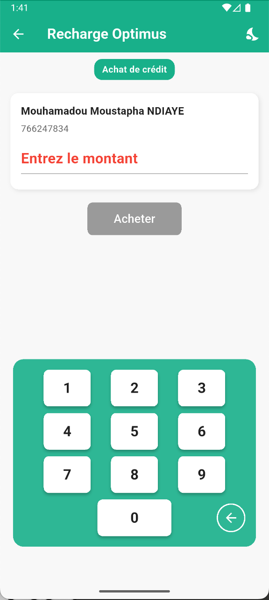
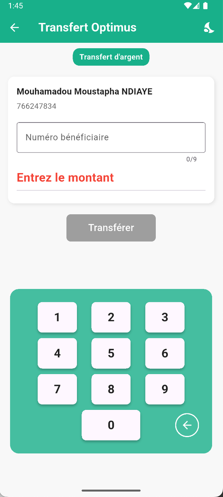
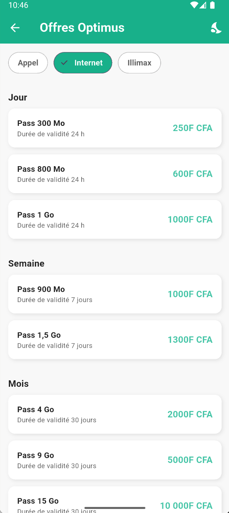
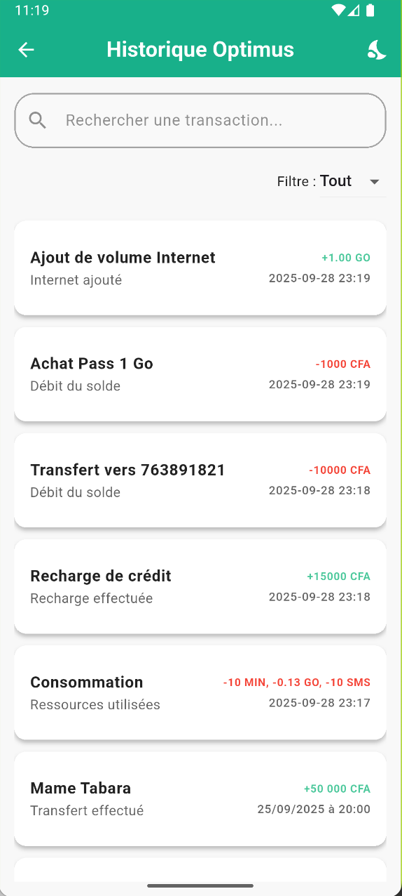
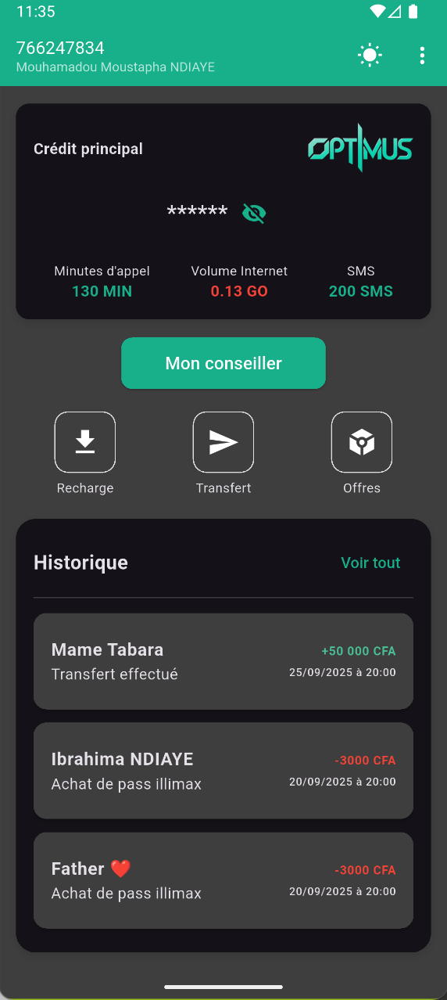
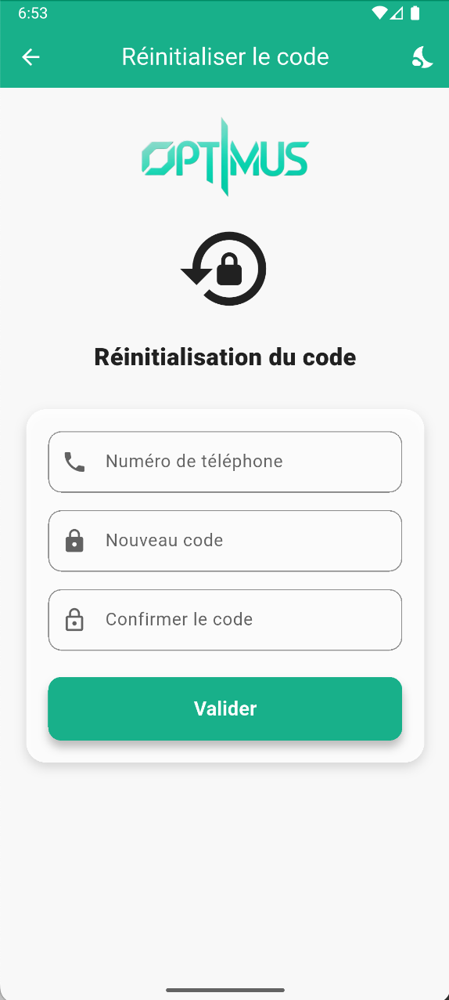

# Optimus

## Introduction
Optimus est une application mobile développée avec Flutter qui aide les utilisateurs à gérer des opérations financières courantes (recharges, transferts), consulter des offres et obtenir des recommandations personnalisées. L'application propose un thème clair/sombre, une navigation simple et une structure modulaire pour faciliter les évolutions.

## Stack technique
## Stack technique
-  Flutter (UI)
-  Dart (langage)
- ⚙️ Provider (gestion d'état)
-  Android / Android Studio (IDE)
-  Gradle (build Android)
- Android / iOS / Web via Flutter

## Fonctionnalités

### Côté utilisateur (UI)
- 🔑 Connexion : écran de login pour accéder à l'application (`loginpage.dart`).
- 🏠 Accueil : point d'entrée après authentification (`homepage.dart`).
- 💳 Recharge : effectuer des recharges de crédit (`rechargepage.dart`).
- 🔁 Transfert : envoyer des fonds à d'autres comptes (`transfertpage.dart`).
- 📦 Offres : lister et consulter des offres disponibles (`offrespage.dart`).
- 💡 Recommandations : page de recommandations personnalisées (`recommendationpage.dart`).
- 📜 Historique : consultation de l'historique des transactions (`historiquepage.dart`).
- 🎨 Thèmes : support des modes clair et sombre via `ThemeProvider` et `AppTheme`.

### Backend / Architecture
- 🧭 Gestion d'état : `Provider` / `ChangeNotifier` (`CreditProvider`, `ThemeProvider`).
- 🗂 Modèles : `Offer`, `Transaction`, `CreditProvider`, `ThemeProvider` dans `lib/models/`.
 
- ♻️ Séparation UI / logique : pages dédiées et providers pour la logique métier.

## Organisation du projet
- `lib/` : code source principal
	- `main.dart` : initialisation, `MultiProvider` et configuration du thème
	- pages : `loginpage.dart`, `homepage.dart`, `rechargepage.dart`, `transfertpage.dart`, `offrespage.dart`, `historiquepage.dart`, `recommendationpage.dart`
	- `models/` : `apptheme.dart`, `creditprovider.dart`, `offer.dart`, `transaction.dart`, `themeprovider.dart`
- `android/`, `ios/`, `web/` : projets natifs / configurations

## Lancer le projet (local)
Assurez-vous d'avoir Flutter installé et configuré (https://flutter.dev).

1. Installer les dépendances :

```bash
flutter pub get
```

2. Lancer l'application sur un appareil connecté / émulateur :

```bash
flutter run
```

3. Construire un APK de release Android :

```bash
flutter build apk --release
```

> Remarque : le projet contient `android/app/google-services.json`. Si vous activez Firebase pour iOS, ajoutez `GoogleService-Info.plist` dans le projet Xcode.

## Apprentissages
- Utilisation du pattern Provider pour séparer l'état applicatif de l'UI (`ChangeNotifier`, `MultiProvider`).
- Gestion centralisée des thèmes via `AppTheme` pour garantir la cohérence visuelle.
- Organisation modulaire (pages + modèles) facilitant la maintenance.
- Préparation possible à l'intégration de services externes (des fichiers de configuration peuvent être présents mais ne sont pas utilisés par les pages actuelles).
- Bonnes pratiques Flutter : appeler `WidgetsFlutterBinding.ensureInitialized()` avant les opérations asynchrones au démarrage.

## Améliorations possibles

### Maturité & architecture
- Extraire la logique métier dans des services (ex. `TransactionService`, `OfferService`) et ajouter une couche Repository pour découpler les sources de données.
- Ajouter l'injection de dépendances pour faciliter les tests et la substitution d'implémentations.

### Expérience utilisateur (UX)
- Améliorer les retours (indicateurs de chargement, messages d'erreur) et ajouter des validations de formulaires robustes.
- Intégrer un onboarding/tutoriel pour les nouveaux utilisateurs.

### Performance
- Mettre en cache les données fréquentes (offres / recommandations) et utiliser la pagination pour les listes longues.
- Réduire les rebuilds inutiles (utiliser `const`, `Selector` quand approprié) et profiler l'app pour localiser les goulots d'étranglement.

### Tests
- Ajouter des tests unitaires pour les providers (`CreditProvider`, `ThemeProvider`) et les services métier.
- Ajouter des tests widget et des tests d'intégration pour couvrir les flux critiques (recharge, transfert).

### Intégration Firebase (perspective)
- Le projet peut contenir des fichiers de configuration Firebase pour Android (par ex. `android/app/google-services.json`) mais Firebase n'est pas implémenté dans les pages/flux actuels.
- Intégrer Firebase reste une piste d'amélioration intéressante pour :
	- centraliser les données (transactions, offres) via Firestore,
	- ajouter une authentification sécurisée (Firebase Auth),
	- collecter des analytics et crash reports (Analytics / Crashlytics),
	- simplifier le stockage côté serveur et l'application de règles de sécurité.
  
	Avant d'activer Firebase en production, pensez à :
	- retirer ou sécuriser les fichiers de configuration non utilisés,
	- ajouter des règles Firestore strictes et des tests d'intégration,
	- configurer les identifiants pour iOS (`GoogleService-Info.plist`) si nécessaire.

## CI / Déploiement (suggestion)
- Ajouter une pipeline CI (GitHub Actions / Codemagic / Bitrise) pour lancer `flutter analyze`, `flutter test` et builder des artefacts.

## Captures d'écran

Screenshot : Login



Screenshot : Accueil



Screenshot : Conseiller Optimus



Screenshot : Recharge



Screenshot : Transfert



Screenshot : Offres



Screenshot : Historique



Screenshot : Theme Switch



Screenshot : Code Change



